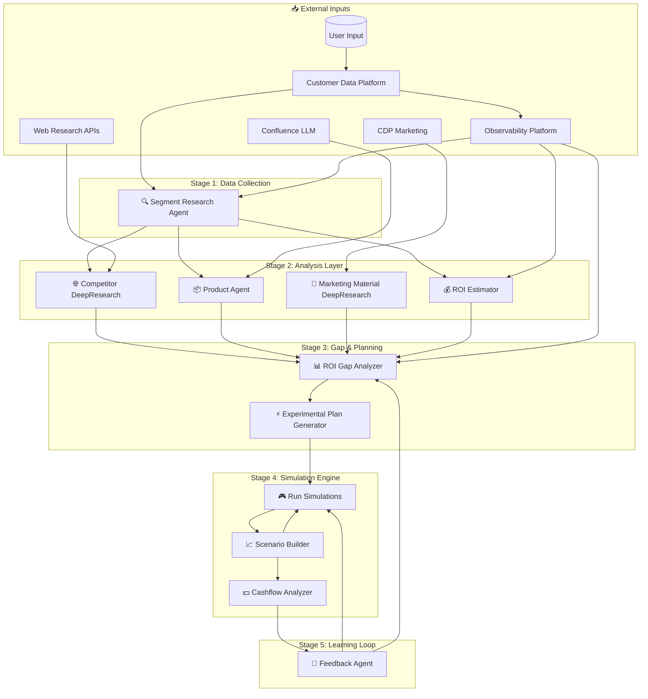
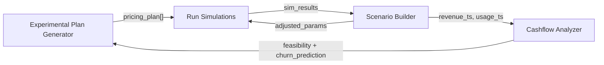

# Technical Product Requirements Document
## AI-Driven Pricing & Revenue Optimization Engine

---

## Executive Summary

This document specifies a **multi-agent pricing optimization system** that uses reinforcement learning to dynamically adjust pricing strategies. The system processes data from 11 specialized AI agents organized in a 5-stage pipeline, enabling:

- **Real-time competitive positioning** via web research agents
- **ROI-driven pricing** calibrated to customer segments  
- **RL-based simulation** with stochastic modeling for price sensitivity
- **Closed-loop learning** from customer feedback to continuously improve predictions

**Key Innovation:** The system treats pricing as a sequential decision problem, where each pricing decision affects future customer behavior—enabling long-term optimization over immediate revenue capture.

---

# Part 1: System Architecture & Data Flow

## High-Level Architecture



## 5-Stage Pipeline

| Stage | Agents | Purpose | Latency |
|-------|--------|---------|---------|
| **1. Collection** | Segment Research Agent | Gather segment data from CDP/Observability | ~500ms |
| **2. Analysis** | Competitor DR, Product, Marketing DR, ROI Estimator | Parallel processing of market/product data | ~2-5s |
| **3. Optimization** | ROI Gap Analyzer, Experimental Plan Generator | Gap detection and pricing plan generation | ~1s |
| **4. Simulation** | Run Simulations, Scenario Builder, Cashflow Analyzer | RL-based testing with cashflow validation | ~10-30s |
| **5. Feedback** | Feedback Agent | Continuous learning loop | Async |

## Key Integration: Competitor DeepResearch → ROI Gap Analyzer

### Data Structure

```json
{
  "CompetitorAnalysisDTO": {
    "experiment_id": "uuid",
    "segment_id": "string",
    "analysis_timestamp": "ISO8601",
    "ttl_seconds": 86400,
    
    "competitive_positioning": {
      "market_position": "leader | challenger | follower | niche",
      "positioning_score": 0.0-1.0,
      "confidence": 0.0-1.0,
      "key_differentiators": ["string"],
      "data_freshness_hours": "number"
    },
    
    "competitor_pricing": [{
      "competitor_name": "string",
      "product_tier": "string",
      "base_price": "number",
      "currency": "USD",
      "pricing_model": "subscription | usage | hybrid",
      "last_updated": "ISO8601"
    }],
    
    "market_insights": {
      "price_sensitivity_index": 0.0-1.0,
      "segment_price_ceiling": "number",
      "segment_price_floor": "number",
      "elasticity_estimate": "number"
    }
  }
}
```

**Integration Logic:**
```
competitive_gap = our_price - weighted_avg(competitor_prices)
market_adjusted_roi = estimated_roi × (1 - price_sensitivity_index × competitive_gap)
```

---

# Part 2: Reinforcement Learning Strategy

## MDP Formulation

### Action Space

The RL agent selects from a **discrete action space** representing pricing decisions:

```
A = {
  DECREASE_LARGE:  -15% to -25% price adjustment,
  DECREASE_SMALL:  -5% to -15% price adjustment,
  MAINTAIN:         ±5% (no significant change),
  INCREASE_SMALL:  +5% to +15% price adjustment,
  INCREASE_LARGE:  +15% to +25% price adjustment,
  BUNDLE_ADD:       Add value bundle (increase perceived ROI),
  BUNDLE_REMOVE:    Remove bundle (reduce cost-to-serve)
}
```

### State Space

```
S(t) = { P(t), M(t), C(t), U(t) }
```

| Dimension | Variables | Source | Normalization |
|-----------|-----------|--------|---------------|
| **P(t) - Product** | `feature_count`, `cost_to_serve`, `unique_value_score` | Product Agent | Min-max scaled |
| **M(t) - Market** | `competitor_price_avg`, `price_sensitivity_idx`, `elasticity` | Competitor DR | Z-score |
| **C(t) - Customer** | `segment_size`, `adoption_rate`, `churn_rate`, `NPS` | Segment Research | Min-max scaled |
| **U(t) - Usage** | `intensity`, `feature_utilization`, `engagement_trend` | CDP Observability | Rolling 30d avg |

### Reward Function

```
R(s, a) = α × ΔRevenue + β × ΔCLTV + γ × AdoptionRate - λ × ChurnPenalty
```

| Parameter | Weight | Rationale |
|-----------|--------|-----------|
| **α (alpha)** | 0.3 | Immediate cashflow—necessary for business viability |
| **β (beta)** | 0.4 | CLTV prioritized to prevent churn-inducing price hikes |
| **γ (gamma)** | 0.2 | Adoption rate for market share capture |
| **λ (lambda)** | 0.1 | Churn penalty to discourage volatile pricing |

**Why these weights?** A pure revenue objective leads to price maximization → short-term gains but customer churn. Weighting CLTV highest ensures the agent learns that retaining customers at moderate prices outperforms extracting maximum value and losing them.

### Training Algorithm

**Recommended: Soft Actor-Critic (SAC)** over PPO/DQN because:
- Handles continuous state space efficiently
- Maximum entropy framework encourages exploration of pricing strategies
- More sample-efficient for expensive real-world pricing experiments

**Alternative:** If interpretability is critical, use **Contextual Bandits** with Thompson Sampling for initial deployment, graduating to full RL after data accumulation.

## Simulation Loop



### Stochastic Modeling

The simulation incorporates uncertainty via:
- **Price sensitivity**: Modeled as Beta distribution (captures bounded [0,1] uncertainty)
- **Churn events**: Poisson process with rate λ = f(price, satisfaction)
- **Market shocks**: Geometric Brownian Motion for competitor price changes

### High Churn Response Protocol

| Churn Level | Threshold | System Response |
|-------------|-----------|-----------------|
| Low | <5% | ✅ Approve pricing plan |
| Medium | 5-15% | ⚠️ Inject retention incentives, re-simulate |
| High | >15% | 🔄 Generate 2-3 alternative plans with lower price points |
| Critical | >25% | 🛑 Halt deployment, escalate to human review |

---

# Part 3: Gap Analysis & Strategic Assessment

## Scenario

| Signal | Source | Finding |
|--------|--------|---------|
| Marketing messaging **ACCURATE** | Feedback Agent | Customers believe our claims |
| Churn is **HIGH** | Cashflow Analyzer | Customers leave anyway |

**The Paradox:** If customers believe the value proposition, why do they churn?

## Hypothesis: ROI Estimator Failure (Pricing Issue)

### Differential Diagnosis

| Hypothesis | Evidence Test | Verdict |
|------------|---------------|---------|
| **Targeting Issue** | Wrong ICP → messaging wouldn't resonate | ❌ Ruled out (messaging believed) |
| **Product Issue** | Missing features → messaging seen as misleading | ❌ Ruled out (messaging accurate) |
| **Pricing Issue** | Value believed but not received at price paid | ✅ **Root Cause** |

### Root Cause Analysis

```
PRIMARY (70%): ROI Estimator Miscalculation
├── Overestimates ROI customers will receive
├── Leads to aggressive price points
└── Customers churn when realized ROI < expected ROI

SECONDARY (30%): Product Agent - Cost Underestimation
├── Variable costs may exceed estimates
└── Erodes customer's net ROI over time
```

### Why NOT Targeting?

The Segment Research Agent asks: *"Does the pricing objective apply for this segment based on usecase?"*

If targeting were wrong, customers in the wrong ICP wouldn't relate to the messaging at all. The fact that messaging resonates proves segment selection is correct.

### Why NOT Product?

The Product Agent extracts: *"Features → roadmap → ICP → fixed costs → variable costs"*

If the product were failing to deliver, customers would report the marketing as *misleading*. They don't—they believe it. The product exists; it just doesn't deliver enough value for the price.

### Recommendations

| Priority | Action | Owner Agent | Expected Impact |
|----------|--------|-------------|-----------------|
| P0 | Recalibrate ROI model with post-purchase data | ROI Estimator | Align pricing with actual delivered value |
| P1 | Add delivered ROI tracking | Feedback Agent | Enable closed-loop calibration |
| P2 | Include hidden costs in estimates | Product Agent | More accurate TCO modeling |
| P3 | Offer value bundles or lower entry tier | Experimental Plan Generator | Immediate churn reduction |

---

## Technical Implementation Notes

### Recommended Tech Stack

| Component | Technology | Rationale |
|-----------|------------|-----------|
| Agent Orchestration | LangGraph / CrewAI | Multi-agent coordination with state management |
| RL Environment | Gymnasium + Stable-Baselines3 | Industry-standard RL toolkit |
| Simulation | SimPy / Mesa | Discrete event simulation for cashflow |
| Vector Store | Pinecone / Weaviate | Competitor research embeddings |
| LLM Backend | GPT-4 / Claude | Deep research and analysis tasks |
| Data Pipeline | Apache Kafka | Real-time feedback ingestion |
| Observability | OpenTelemetry + Grafana | Agent performance monitoring |

### Edge Cases to Handle

1. **Cold Start:** New segment with no historical data → Use transfer learning from similar segments
2. **Market Shock:** Competitor drops price 30% → Trigger emergency re-simulation with expanded action space
3. **Feedback Sparsity:** Low survey response → Weight implicit signals (usage patterns) higher
4. **Price War Detection:** Multiple consecutive DECREASE actions → Cap at floor price, alert human

---

## Appendix: Agent Reference

| Agent | External Input | Output |
|-------|---------------|--------|
| Segment Research | CDP Observability | Segment applicability for pricing objective |
| Competitor DeepResearch | Web APIs | Competitive positioning analysis |
| Product | Confluence LLM | Features, roadmap, ICP, costs |
| ROI Estimator | CDP Observability | Per-segment ROI calculations |
| ROI Gap Analyzer | CDP Observability | Delivered vs Proposed ROI gaps |
| Experimental Plan Generator | - | 2-3 new pricing plans |
| Run Simulations | CDP RL Environment | Price sensitivity modeling |
| Scenario Builder | Simulation Results | Time-series projections |
| Cashflow Analyzer | Revenue data | Feasibility rating |
| Feedback Agent | Customer feedback | RL training data |
| Marketing Material DR | CDP Marketing | Messaging accuracy assessment |

---

## Assumptions Made

| Assumption | Rationale |
|------------|-----------|
| CDP provides real-time data (not batch) | RL requires timely state updates for accurate decisions |
| RL model trains offline, deploys online | Online training is risky for pricing (expensive mistakes) |
| Pricing experiments have ~2-4 week cycles | Need enough data to measure churn/adoption effects |
| Competitor prices are publicly available | Required for Competitor DeepResearch agent |

## Questions I Would Ask

1. **Latency requirements?** Does pricing need to be real-time or is daily batch acceptable?
2. **Regulatory constraints?** Any legal limits on dynamic pricing in your markets?
3. **Existing data infrastructure?** Kafka, Spark, data warehouse tech?
4. **Current pricing process?** Fully manual, rule-based, or already some automation?
5. **Success metrics?** Revenue? Churn reduction? Market share?

---

## If I Had More Time

| Priority | Enhancement | Impact |
|----------|-------------|--------|
| 1 | **Causal inference layer** - Determine WHY churn happens, not just correlation | Better root cause analysis |
| 2 | **Multi-objective Pareto optimization** - Instead of weighted sum | Clearer trade-off decisions |
| 3 | **A/B test framework** - Safe deployment with statistical rigor | Reduced risk |
| 4 | **Explainability dashboard** - For non-technical stakeholders | Better adoption |
| 5 | **Real-time adaptation** - Online learning for immediate market response | Faster reaction |

