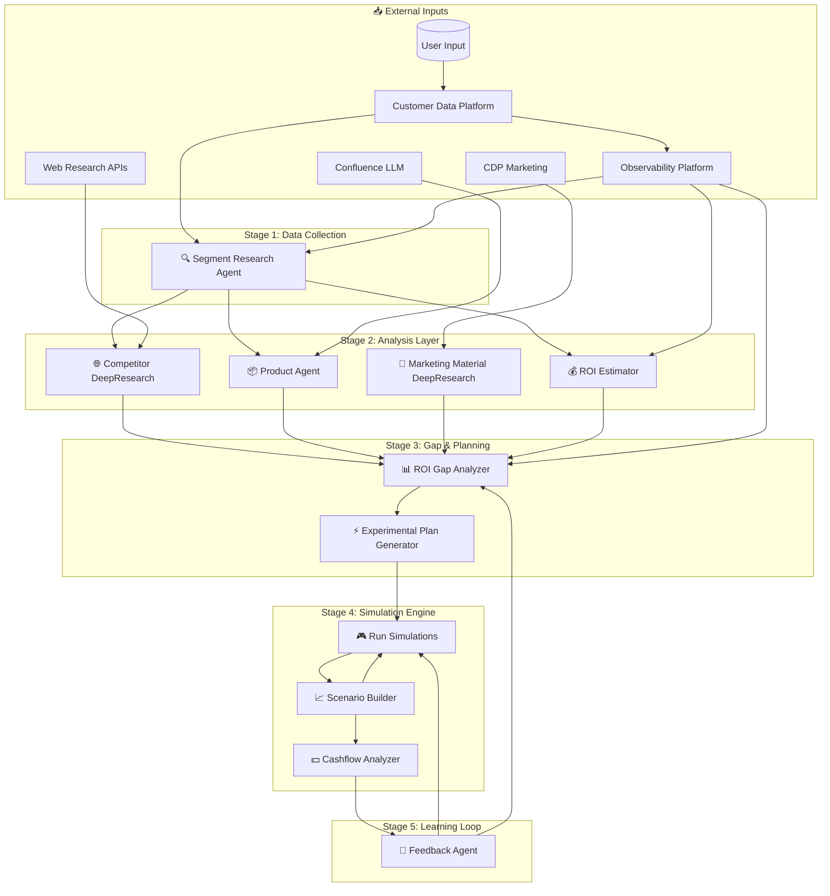

# Part 1: System Architecture & Data Flow

## High-Level Architecture



---

## 5-Stage Pipeline

| Stage | Agents | Purpose | Latency |
|-------|--------|---------|---------|
| **1. Collection** | Segment Research Agent | Gather segment data from CDP/Observability | ~500ms |
| **2. Analysis** | Competitor DR, Product, Marketing DR, ROI Estimator | Parallel processing of market/product data | ~2-5s |
| **3. Optimization** | ROI Gap Analyzer, Experimental Plan Generator | Gap detection and pricing plan generation | ~1s |
| **4. Simulation** | Run Simulations, Scenario Builder, Cashflow Analyzer | RL-based testing with cashflow validation | ~10-30s |
| **5. Feedback** | Feedback Agent | Continuous learning loop | Async |

---

## Key Integration: Competitor DeepResearch → ROI Gap Analyzer

### Data Structure

```json
{
  "CompetitorAnalysisDTO": {
    "experiment_id": "uuid",
    "segment_id": "string",
    "analysis_timestamp": "ISO8601",
    "ttl_seconds": 86400,
    
    "competitive_positioning": {
      "market_position": "leader | challenger | follower | niche",
      "positioning_score": 0.0-1.0,
      "confidence": 0.0-1.0,
      "key_differentiators": ["string"],
      "data_freshness_hours": "number"
    },
    
    "competitor_pricing": [{
      "competitor_name": "string",
      "product_tier": "string",
      "base_price": "number",
      "currency": "USD",
      "pricing_model": "subscription | usage | hybrid",
      "last_updated": "ISO8601"
    }],
    
    "market_insights": {
      "price_sensitivity_index": 0.0-1.0,
      "segment_price_ceiling": "number",
      "segment_price_floor": "number",
      "elasticity_estimate": "number"
    }
  }
}
```

### Integration Logic

```
competitive_gap = our_price - weighted_avg(competitor_prices)
market_adjusted_roi = estimated_roi × (1 - price_sensitivity_index × competitive_gap)
```

The ROI Gap Analyzer consumes this DTO to contextualize internal ROI gaps against market realities.

---

## Summary

The system follows a **5-stage pipeline**:

1. **Collection** → Gather segment data from CDP/Observability
2. **Analysis** → Parallel processing by 4 specialized agents
3. **Optimization** → Gap detection and pricing plan generation
4. **Simulation** → RL-based testing with cashflow validation
5. **Feedback** → Continuous learning loop for model improvement
