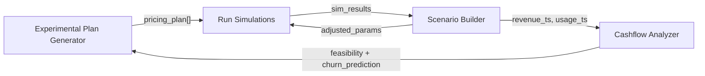

# Part 2: RL Strategy Logic Definition Memo

**Subject:** Reinforcement Learning Environment for Pricing Optimization  
**Focus Agent:** Run Simulations

---

## MDP Formulation

### Action Space

The RL agent selects from a **discrete action space** representing pricing decisions:

```
A = {
  DECREASE_LARGE:  -15% to -25% price adjustment,
  DECREASE_SMALL:  -5% to -15% price adjustment,
  MAINTAIN:         ±5% (no significant change),
  INCREASE_SMALL:  +5% to +15% price adjustment,
  INCREASE_LARGE:  +15% to +25% price adjustment,
  BUNDLE_ADD:       Add value bundle (increase perceived ROI),
  BUNDLE_REMOVE:    Remove bundle (reduce cost-to-serve)
}
```

---

## State Space Definition

```
S(t) = { P(t), M(t), C(t), U(t) }
```

| Dimension | Variables | Source | Normalization |
|-----------|-----------|--------|---------------|
| **P(t) - Product** | `feature_count`, `cost_to_serve`, `unique_value_score` | Product Agent | Min-max scaled |
| **M(t) - Market** | `competitor_price_avg`, `price_sensitivity_idx`, `elasticity` | Competitor DR | Z-score |
| **C(t) - Customer** | `segment_size`, `adoption_rate`, `churn_rate`, `NPS` | Segment Research | Min-max scaled |
| **U(t) - Usage** | `intensity`, `feature_utilization`, `engagement_trend` | CDP Observability | Rolling 30d avg |

---

## Reward Function

```
R(s, a) = α × ΔRevenue + β × ΔCLTV + γ × AdoptionRate - λ × ChurnPenalty
```

| Parameter | Weight | Rationale |
|-----------|--------|-----------|
| **α (alpha)** | 0.3 | Immediate cashflow—necessary for business viability |
| **β (beta)** | 0.4 | CLTV prioritized to prevent churn-inducing price hikes |
| **γ (gamma)** | 0.2 | Adoption rate for market share capture |
| **λ (lambda)** | 0.1 | Churn penalty to discourage volatile pricing |

**Why these weights?** A pure revenue objective leads to price maximization → short-term gains but customer churn. Weighting CLTV highest ensures the agent learns that retaining customers at moderate prices outperforms extracting maximum value and losing them.

---

## Training Algorithm

**Recommended: Soft Actor-Critic (SAC)** over PPO/DQN because:
- Handles continuous state space efficiently
- Maximum entropy framework encourages exploration of pricing strategies
- More sample-efficient for expensive real-world pricing experiments

**Alternative:** If interpretability is critical, use **Contextual Bandits** with Thompson Sampling for initial deployment, graduating to full RL after data accumulation.

---

## Simulation Loop



### Stochastic Modeling

The simulation incorporates uncertainty via:
- **Price sensitivity**: Modeled as Beta distribution (captures bounded [0,1] uncertainty)
- **Churn events**: Poisson process with rate λ = f(price, satisfaction)
- **Market shocks**: Geometric Brownian Motion for competitor price changes

---

## High Churn Response Protocol

| Churn Level | Threshold | System Response |
|-------------|-----------|-----------------|
| Low | <5% | ✅ Approve pricing plan |
| Medium | 5-15% | ⚠️ Inject retention incentives, re-simulate |
| High | >15% | 🔄 Generate 2-3 alternative plans with lower price points |
| Critical | >25% | 🛑 Halt deployment, escalate to human review |

---

## Summary

The RL environment uses a **weighted composite reward** prioritizing CLTV (40%) over immediate revenue (30%). The agent operates over a 7-action discrete space with SAC as the recommended training algorithm. Stochastic modeling via Beta/Poisson/GBM distributions captures real-world uncertainty.
